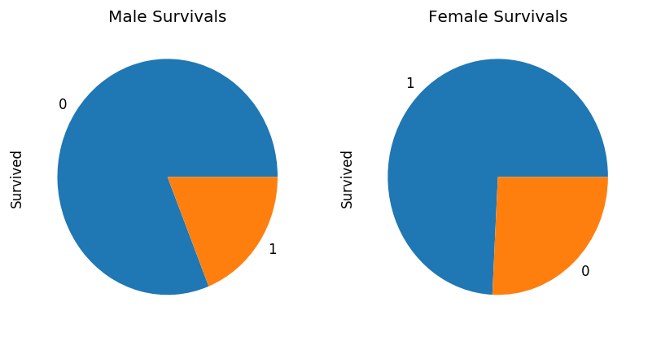
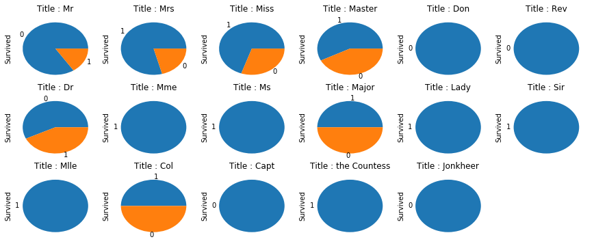
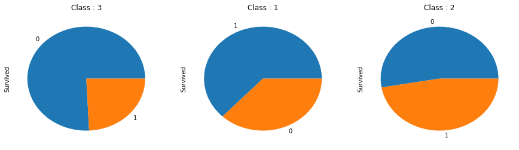
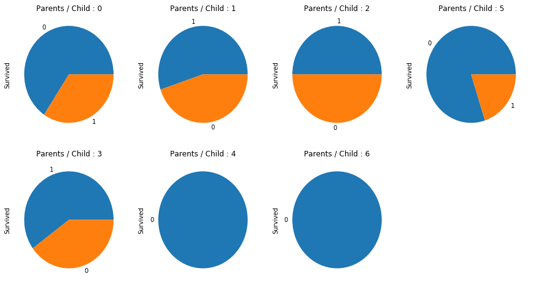

Import Pandas and Numpy libraries. These are the main libraries for array computations.


```python
import pandas as pd
import numpy as np
%matplotlib inline
```

Define the data root to be take train data from.


```python
DATA_ROOT = './data/'
```

Load the train and test data using read_csv function in the Pandas library.


```python
train_data = pd.read_csv(DATA_ROOT + 'train.csv')
test_data = pd.read_csv(DATA_ROOT + 'test.csv')
```

A function to separate the different outputs of each section. This will be used to display the data in the terminal in a readable way.


```python
def separate_output(str):
    '''
        Displays an string as an argument in a clear form
    '''
    SHARP_COUNT = 100
    print('\n')
    for i in range(SHARP_COUNT):
        if(i == SHARP_COUNT-1):
            print("#")
        else:
            print("#", end="")

    # Display info at the center
    for i in range(int((SHARP_COUNT/2-len(str)/2))):
        print("",end=" ")

    print(str)

    for i in range(SHARP_COUNT):
        print("#", end="")
    print('\n')
```

Find out how the data looks like. This helps us to get an intuition of features inside the datasets. This is done using the shape class member of a Pandas dataframe.


```python
separate_output("Train/Test Shapes")
print(train_data.shape)
print(test_data.shape)
```

    
    
    ####################################################################################################
                                             Train/Test Shapes
    ####################################################################################################
    
    (891, 12)
    (418, 11)


This will provide some statistical knowledge about the data. We can observe the mean, variance, max and minimum of data for each feature. This can be used for data normalization and preprocessing. We have used the describe method from the Pandas dataframe class.


```python
separate_output("General Data Knowledge")
train_data.describe()
```

    
    
    ####################################################################################################
                                           General Data Knowledge
    ####################################################################################################
    


<div>
<style scoped>
    .dataframe tbody tr th:only-of-type {
        vertical-align: middle;
    }

    .dataframe tbody tr th {
        vertical-align: top;
    }

    .dataframe thead th {
        text-align: right;
    }
</style>
<table border="1" class="dataframe">
  <thead>
    <tr style="text-align: right;">
      <th></th>
      <th>PassengerId</th>
      <th>Survived</th>
      <th>Pclass</th>
      <th>Age</th>
      <th>SibSp</th>
      <th>Parch</th>
      <th>Fare</th>
    </tr>
  </thead>
  <tbody>
    <tr>
      <th>count</th>
      <td>891.000000</td>
      <td>891.000000</td>
      <td>891.000000</td>
      <td>714.000000</td>
      <td>891.000000</td>
      <td>891.000000</td>
      <td>891.000000</td>
    </tr>
    <tr>
      <th>mean</th>
      <td>446.000000</td>
      <td>0.383838</td>
      <td>2.308642</td>
      <td>29.699118</td>
      <td>0.523008</td>
      <td>0.381594</td>
      <td>32.204208</td>
    </tr>
    <tr>
      <th>std</th>
      <td>257.353842</td>
      <td>0.486592</td>
      <td>0.836071</td>
      <td>14.526497</td>
      <td>1.102743</td>
      <td>0.806057</td>
      <td>49.693429</td>
    </tr>
    <tr>
      <th>min</th>
      <td>1.000000</td>
      <td>0.000000</td>
      <td>1.000000</td>
      <td>0.420000</td>
      <td>0.000000</td>
      <td>0.000000</td>
      <td>0.000000</td>
    </tr>
    <tr>
      <th>25%</th>
      <td>223.500000</td>
      <td>0.000000</td>
      <td>2.000000</td>
      <td>20.125000</td>
      <td>0.000000</td>
      <td>0.000000</td>
      <td>7.910400</td>
    </tr>
    <tr>
      <th>50%</th>
      <td>446.000000</td>
      <td>0.000000</td>
      <td>3.000000</td>
      <td>28.000000</td>
      <td>0.000000</td>
      <td>0.000000</td>
      <td>14.454200</td>
    </tr>
    <tr>
      <th>75%</th>
      <td>668.500000</td>
      <td>1.000000</td>
      <td>3.000000</td>
      <td>38.000000</td>
      <td>1.000000</td>
      <td>0.000000</td>
      <td>31.000000</td>
    </tr>
    <tr>
      <th>max</th>
      <td>891.000000</td>
      <td>1.000000</td>
      <td>3.000000</td>
      <td>80.000000</td>
      <td>8.000000</td>
      <td>6.000000</td>
      <td>512.329200</td>
    </tr>
  </tbody>
</table>
</div>


Some features like PassengerId, Name, Ticket, Cavbin and Embarked can be removed from the dataset.


```python
# These columns will be dropped
DROPPED_COLS = ['PassengerId',
                'Ticket',
                'Cabin',
                'Embarked']

# Drop the PassengerId column
train_data.drop(DROPPED_COLS, axis=1, inplace=True)
```


```python
# Get the shape of data
separate_output("Train/Test Shapes -- Dropped 5 Columns")
print(train_data.shape)
print(test_data.shape)
```

    
    
    ####################################################################################################
                                   Train/Test Shapes -- Dropped 5 Columns
    ####################################################################################################
    
    (891, 8)
    (418, 11)


Let's plot the pie chart of the sex. We want to analyze if the gender affects the survivals or not. At the first glance, it seems that gender could be a good feature for prediction. These plots confirm this idea.


```python
import matplotlib.pyplot as plt

# Check if the gender affect the survivals
# Plot the figures for male and female
fig = plt.figure(figsize=(8, 4), dpi=120, facecolor='w', edgecolor='k')
fig.canvas.set_window_title("Analaysis of Gender Effect on Survivals")

male_survival = fig.add_subplot(121)
train_data.Survived[train_data['Sex'] == 'male'].value_counts().plot(kind='pie')
male_survival.set_title("Male Survivals")

female_survival = fig.add_subplot(122)
train_data.Survived[train_data['Sex'] == 'female'].value_counts().plot(kind='pie')
female_survival.set_title("Female Survivals")
plt.show()
```





Let's check the datatypes to make sure there are no more objects left in the dataset. Objects are representing a text most of the times(Categorical Data). We obtain this using select_dtypes from the Pandas Dataframe class.


```python
# Let's see if there are any more categorical data left
separate_output("Datatypes")
print(train_data.select_dtypes(include=[object]))
```

    
    
    ####################################################################################################
                                                 Datatypes
    ####################################################################################################
    
                                                      Name     Sex
    0                              Braund, Mr. Owen Harris    male
    1    Cumings, Mrs. John Bradley (Florence Briggs Th...  female
    2                               Heikkinen, Miss. Laina  female
    3         Futrelle, Mrs. Jacques Heath (Lily May Peel)  female
    4                             Allen, Mr. William Henry    male
    5                                     Moran, Mr. James    male
    6                              McCarthy, Mr. Timothy J    male
    7                       Palsson, Master. Gosta Leonard    male
    8    Johnson, Mrs. Oscar W (Elisabeth Vilhelmina Berg)  female
    9                  Nasser, Mrs. Nicholas (Adele Achem)  female
    10                     Sandstrom, Miss. Marguerite Rut  female
    11                            Bonnell, Miss. Elizabeth  female
    12                      Saundercock, Mr. William Henry    male
    13                         Andersson, Mr. Anders Johan    male
    14                Vestrom, Miss. Hulda Amanda Adolfina  female
    15                    Hewlett, Mrs. (Mary D Kingcome)   female
    16                                Rice, Master. Eugene    male
    17                        Williams, Mr. Charles Eugene    male
    18   Vander Planke, Mrs. Julius (Emelia Maria Vande...  female
    19                             Masselmani, Mrs. Fatima  female
    20                                Fynney, Mr. Joseph J    male
    21                               Beesley, Mr. Lawrence    male
    22                         McGowan, Miss. Anna "Annie"  female
    23                        Sloper, Mr. William Thompson    male
    24                       Palsson, Miss. Torborg Danira  female
    25   Asplund, Mrs. Carl Oscar (Selma Augusta Emilia...  female
    26                             Emir, Mr. Farred Chehab    male
    27                      Fortune, Mr. Charles Alexander    male
    28                       O'Dwyer, Miss. Ellen "Nellie"  female
    29                                 Todoroff, Mr. Lalio    male
    ..                                                 ...     ...
    861                        Giles, Mr. Frederick Edward    male
    862  Swift, Mrs. Frederick Joel (Margaret Welles Ba...  female
    863                  Sage, Miss. Dorothy Edith "Dolly"  female
    864                             Gill, Mr. John William    male
    865                           Bystrom, Mrs. (Karolina)  female
    866                       Duran y More, Miss. Asuncion  female
    867               Roebling, Mr. Washington Augustus II    male
    868                        van Melkebeke, Mr. Philemon    male
    869                    Johnson, Master. Harold Theodor    male
    870                                  Balkic, Mr. Cerin    male
    871   Beckwith, Mrs. Richard Leonard (Sallie Monypeny)  female
    872                           Carlsson, Mr. Frans Olof    male
    873                        Vander Cruyssen, Mr. Victor    male
    874              Abelson, Mrs. Samuel (Hannah Wizosky)  female
    875                   Najib, Miss. Adele Kiamie "Jane"  female
    876                      Gustafsson, Mr. Alfred Ossian    male
    877                               Petroff, Mr. Nedelio    male
    878                                 Laleff, Mr. Kristo    male
    879      Potter, Mrs. Thomas Jr (Lily Alexenia Wilson)  female
    880       Shelley, Mrs. William (Imanita Parrish Hall)  female
    881                                 Markun, Mr. Johann    male
    882                       Dahlberg, Miss. Gerda Ulrika  female
    883                      Banfield, Mr. Frederick James    male
    884                             Sutehall, Mr. Henry Jr    male
    885               Rice, Mrs. William (Margaret Norton)  female
    886                              Montvila, Rev. Juozas    male
    887                       Graham, Miss. Margaret Edith  female
    888           Johnston, Miss. Catherine Helen "Carrie"  female
    889                              Behr, Mr. Karl Howell    male
    890                                Dooley, Mr. Patrick    male
    
    [891 rows x 2 columns]


We use LabelEncoder to convert the categorical data into the numerical form. To do this, simply create an object of the LabelEncoder class and call the fit_transform function on the desired data column in the dataset.


```python
from sklearn.preprocessing import LabelEncoder, StandardScaler

# Convert the categorical data into numerical form
train_data['Sex'] = LabelEncoder().fit_transform(train_data['Sex'])
```

Split the titles from the passenger names which is itself a feature but also help in calculating missing median age values.


```python
train_data['Name'] = train_data['Name'].map(lambda x: x.split(',')[1].split('.')[0].strip())
titles = train_data['Name'].unique()
titles
```


    array(['Mr', 'Mrs', 'Miss', 'Master', 'Don', 'Rev', 'Dr', 'Mme', 'Ms',
           'Major', 'Lady', 'Sir', 'Mlle', 'Col', 'Capt', 'the Countess',
           'Jonkheer'], dtype=object)


Sneaking into the Age column, we can see there are some NaN numbers. These are called missing values. In order to increase the number of data samples, we need to fill these NaN values with an appropriate values. Fill the NaN values of Age using median values related to its title.


```python
train_data['Age'].fillna(-1, inplace=True)

medians = dict()
for title in titles:
    median = train_data.Age[(train_data["Age"] != -1) & (train_data['Name'] == title)].median()
    medians[title] = median
    
for index, row in train_data.iterrows():
    if row['Age'] == -1:
        train_data.loc[index, 'Age'] = medians[row['Name']]
train_data.head()
```


<div>
<style scoped>
    .dataframe tbody tr th:only-of-type {
        vertical-align: middle;
    }

    .dataframe tbody tr th {
        vertical-align: top;
    }

    .dataframe thead th {
        text-align: right;
    }
</style>
<table border="1" class="dataframe">
  <thead>
    <tr style="text-align: right;">
      <th></th>
      <th>Survived</th>
      <th>Pclass</th>
      <th>Name</th>
      <th>Sex</th>
      <th>Age</th>
      <th>SibSp</th>
      <th>Parch</th>
      <th>Fare</th>
    </tr>
  </thead>
  <tbody>
    <tr>
      <th>0</th>
      <td>0</td>
      <td>3</td>
      <td>Mr</td>
      <td>1</td>
      <td>22.0</td>
      <td>1</td>
      <td>0</td>
      <td>7.2500</td>
    </tr>
    <tr>
      <th>1</th>
      <td>1</td>
      <td>1</td>
      <td>Mrs</td>
      <td>0</td>
      <td>38.0</td>
      <td>1</td>
      <td>0</td>
      <td>71.2833</td>
    </tr>
    <tr>
      <th>2</th>
      <td>1</td>
      <td>3</td>
      <td>Miss</td>
      <td>0</td>
      <td>26.0</td>
      <td>0</td>
      <td>0</td>
      <td>7.9250</td>
    </tr>
    <tr>
      <th>3</th>
      <td>1</td>
      <td>1</td>
      <td>Mrs</td>
      <td>0</td>
      <td>35.0</td>
      <td>1</td>
      <td>0</td>
      <td>53.1000</td>
    </tr>
    <tr>
      <th>4</th>
      <td>0</td>
      <td>3</td>
      <td>Mr</td>
      <td>1</td>
      <td>35.0</td>
      <td>0</td>
      <td>0</td>
      <td>8.0500</td>
    </tr>
  </tbody>
</table>
</div>


Before transforming the Name column into the numerical form, we'll be excavating the distribution of our training data with respect to the Names. We will assign the numbers to these Names according to the distribution of each of these titles shown below.


```python
fig = plt.figure(figsize=(15,6))

i=1
for title in train_data['Name'].unique():
    fig.add_subplot(3, 6, i)
    plt.title('Title : {}'.format(title))
    train_data.Survived[train_data['Name'] == title].value_counts().plot(kind='pie')
    i += 1
```





```python
REPLACEMENTS = {
    'Don': 0,
    'Rev': 0,
    'Jonkheer': 0,
    'Capt': 0,
    'Mr': 1,
    'Dr': 2,
    'Col': 3,
    'Major': 3,
    'Master': 4,
    'Miss': 5,
    'Mrs': 6,
    'Mme': 7,
    'Ms': 7,
    'Mlle': 7,
    'Sir': 7,
    'Lady': 7,
    'the Countess': 7
}

train_data['Name'] = train_data['Name'].apply(lambda x: REPLACEMENTS.get(x))
```

We can also fill the NaN values of Fare using by its correlation with Ticket Class.


```python
train_data['Fare'].fillna(-1, inplace=True)
medians = dict()
for pclass in train_data['Pclass'].unique():
    median = train_data.Fare[(train_data["Fare"] != -1) & (train_data['Pclass'] == pclass)].median()
    medians[pclass] = median
for index, row in train_data.iterrows():
    if row['Fare'] == -1:
        train_data.loc[index, 'Fare'] = medians[row['Pclass']]
```

Plot the distribution of our data with respect to each class of tickets.


```python
fig = plt.figure(figsize=(15,4))

i=1
for pclass in train_data['Pclass'].unique():
    fig.add_subplot(1, 3, i)
    plt.title('Class : {}'.format(pclass))
    train_data.Survived[train_data['Pclass'] == pclass].value_counts().plot(kind='pie')
    i += 1
```





The classes are numeric already. Let's analyze the next feature.


```python
fig = plt.figure(figsize=(15,8))
i = 0
for parch in train_data['Parch'].unique():
    fig.add_subplot(2, 4, i+1)
    plt.title('Parents / Child : {}'.format(parch))
    train_data.Survived[train_data['Parch'] == parch].value_counts().plot(kind='pie')
    i += 1
```





```python
CP_REPLACEMENTS = {
    6: 0,
    4: 0,
    5: 1,
    0: 2,
    2: 3,
    1: 4,
    3: 5
}
train_data['Parch'] = train_data['Parch'].apply(lambda x: CP_REPLACEMENTS.get(x))
```


```python
train_data.head()
```


<div>
<style scoped>
    .dataframe tbody tr th:only-of-type {
        vertical-align: middle;
    }

    .dataframe tbody tr th {
        vertical-align: top;
    }

    .dataframe thead th {
        text-align: right;
    }
</style>
<table border="1" class="dataframe">
  <thead>
    <tr style="text-align: right;">
      <th></th>
      <th>Survived</th>
      <th>Pclass</th>
      <th>Name</th>
      <th>Sex</th>
      <th>Age</th>
      <th>SibSp</th>
      <th>Parch</th>
      <th>Fare</th>
    </tr>
  </thead>
  <tbody>
    <tr>
      <th>0</th>
      <td>0</td>
      <td>3</td>
      <td>1</td>
      <td>1</td>
      <td>22.0</td>
      <td>1</td>
      <td>2</td>
      <td>7.2500</td>
    </tr>
    <tr>
      <th>1</th>
      <td>1</td>
      <td>1</td>
      <td>6</td>
      <td>0</td>
      <td>38.0</td>
      <td>1</td>
      <td>2</td>
      <td>71.2833</td>
    </tr>
    <tr>
      <th>2</th>
      <td>1</td>
      <td>3</td>
      <td>5</td>
      <td>0</td>
      <td>26.0</td>
      <td>0</td>
      <td>2</td>
      <td>7.9250</td>
    </tr>
    <tr>
      <th>3</th>
      <td>1</td>
      <td>1</td>
      <td>6</td>
      <td>0</td>
      <td>35.0</td>
      <td>1</td>
      <td>2</td>
      <td>53.1000</td>
    </tr>
    <tr>
      <th>4</th>
      <td>0</td>
      <td>3</td>
      <td>1</td>
      <td>1</td>
      <td>35.0</td>
      <td>0</td>
      <td>2</td>
      <td>8.0500</td>
    </tr>
  </tbody>
</table>
</div>


Now the data is almost ready to be trained. We can start training using the predefined models in sklearn library. Following models are used in this example.


```python
from sklearn.neural_network import MLPClassifier
from sklearn.svm import SVC
from sklearn.gaussian_process import GaussianProcessClassifier
from sklearn.ensemble import AdaBoostClassifier
from sklearn.discriminant_analysis import QuadraticDiscriminantAnalysis

# An array containing models
MODELS = [
    MLPClassifier(),
    AdaBoostClassifier(),
    SVC(),
    QuadraticDiscriminantAnalysis(),
    GaussianProcessClassifier()
]
```

Since the labels for the test_data is not available, we use train_data for both training and testing. We can use the function train_test_split to split 20% of data for test and 80% for training. The actual labels for the training set is first extracted. The Survived column is dropped. Finally, the train_test_split is called on the tranining data with respective labels.


```python
from sklearn.model_selection import train_test_split

# Split the train and test data
train_labels = train_data['Survived']
train_data.drop('Survived', axis=1, inplace=True)
X_train, X_test, y_train, y_test = train_test_split(train_data, train_labels, test_size=0.2, random_state=42)
```

We have used the recall score and the f1 score to represent the performance of each of these classifiers. The fit functon can be called from each classifier object. It is used to train some data on that specific classifier. The predict function returns the predicted labels.


```python
from sklearn.metrics import recall_score
from sklearn.metrics import f1_score

for model in MODELS:
    model.fit(X_train, y_train)
    prediction = model.predict(X_test)
    rscore = recall_score(y_test, prediction)
    f1score = f1_score(y_test, prediction)
    score = model.score(X_test, y_test)
    print(score)
    print("Recall: ", rscore)
    print("F-1 Score: ", f1score)
```

    0.8100558659217877
    Recall:  0.7702702702702703
    F-1 Score:  0.7702702702702703
    0.7988826815642458
    Recall:  0.7567567567567568
    F-1 Score:  0.7567567567567567
    0.7877094972067039
    Recall:  0.6351351351351351
    F-1 Score:  0.712121212121212
    0.7932960893854749
    Recall:  0.7432432432432432
    F-1 Score:  0.7482993197278911
    0.8044692737430168
    Recall:  0.7297297297297297
    F-1 Score:  0.7552447552447553

